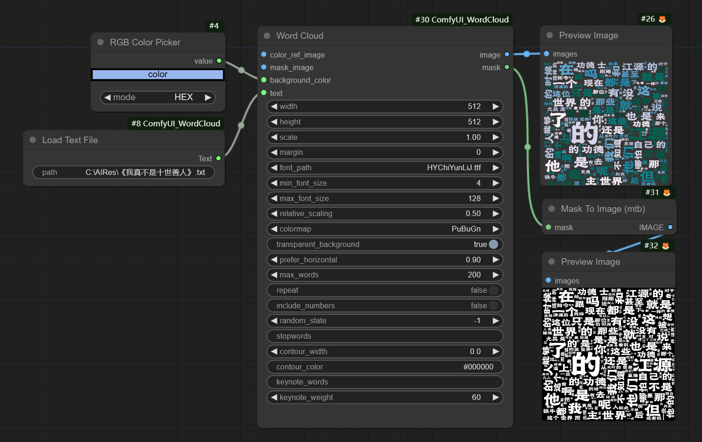
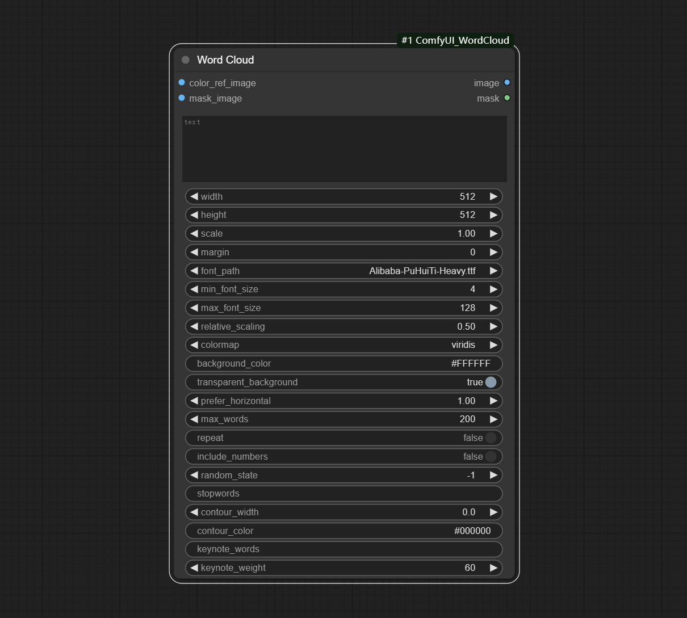
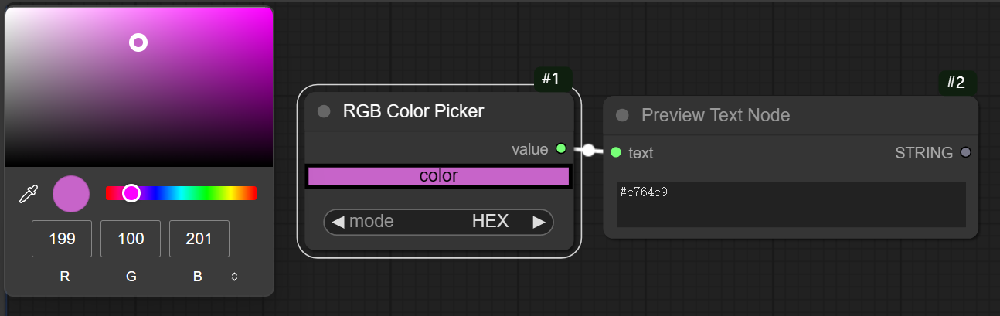
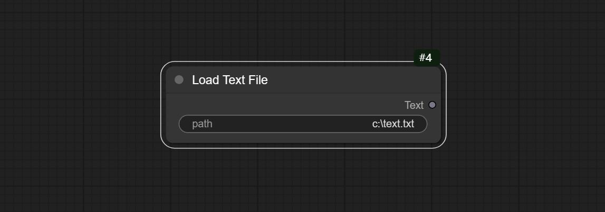

# ComfyUI Word Cloud：
A plugin to generating word cloud images for ComfyUI, it is the implementation of the [word_cloud](https://github.com/amueller/word_cloud) on ComfyUI.


[中文说明点这里](./README_CN.MD)

## Update：
* Word Cloud node add mask output.


* Add RGB Color Picker node that makes color selection more convenient.

* By editing the font_dir.ini, located in the root directory of the plugin, users can customize the font directory. Every time comfyUI is launched, the *.ttf and *.otf files 
in this directory will be collected and displayed in the plugin font_path option.
font_dir.ini defaults to the Windows system font directory (C:\Windows\fonts).
If the custom directory is invalid, the built-in font directory will be enabled，
This directory contains Alibaba-PuHuiTi-Heavy.ttf file, which belongs to Alibaba (China) Co., Ltd. and is free for use by any individual or enterprise.


### Important reminder: The font needs to be reset for the old version nodes saved in the workflow before loading.
* Set the font_dir.ini, and start comfyUI to load workflow, in the font_path of the WordCloud node, reselect the font.

* This update is based on [ZHO-ZHO-ZHO](https://github.com/ZHO-ZHO-ZHO/ComfyUI-Text_Image-Composite)'s suggestions and assistance.


## Node Description

### Word Cloud:

Generate word cloud images based on text content, where word size is related to word frequency, and the higher the frequency, the larger the text. Can define color schemes, set key words, set exclusion words, etc. Support generating word cloud images with contour shapes by inputting images with alpha channels.

Node options：   
* color_ref_image: The input image serves as a reference for text color.
* mask_image: The input image serves as the silhouette of the text shape. If there with alpha channel, use the channel as the contour; The shape of the contour is determined by color without channels, and the white part will be excluded.
* text: The text content here will be broken down into individual words, which serve as elements of the word cloud.
* width: Generate the width of the image. (If there is mask_image input, use the size of mask_image, and this setting value is ignored)
* height: The height of the generated image. (If there is mask_image input, use the size of mask_image, and this setting value is ignored)
* scale: The amplification factor, the final generated image size will be the width and height set values multiplied by this number.
* margin: Blank edge size.
* font_path: font file.
* min_font_size: The minimum value displayed for word elements.
* max_font_size：The maximum value displayed for word elements.
* relative_scaling: The relative size of word elements in the word cloud. The larger the value, the higher the dispersion.
* colormap: Text color. multiple predefined colormaps provided by Matplotlib are used. (If there is input of color_ref_image, this setting is ignored)
* background_color: Background color, described in hexadecimal RGB format. (If transparent background is set to True, this setting is ignored)
* transparent_background: Is the background transparent. Set True here to output images with alpha channels.
* prefer_horizontal: Word level occurrence rate. Minimum 0 (all vertical rows), maximum 1 (all horizontal rows).
* max_words: Maximum number of words.
* repeat: Is it allowed to repeat when the maximum number of words is not reached.
* include_numbers: Does the word element contain numbers.
* random_state：Seed of the random number generator during the word cloud generation process. Set -1 to be random each time, while other values are fixed each time.
* stopwords: The words set here will not appear in the picture. Separate each word with a comma (both in Chinese and English) or a space.
* contour_width: Outline width of silhouette. With a mask_ Image input is only valid.
* contour_color: Color of Outline. With a mask_ Image input is only valid.
* keynote_words: The words set here will be further enlarged, except for those with the same words set in stopwords. Separate each word with a comma (both in Chinese and English) or a space.
* keynote_weight: Weighted key for keynote words. The larger the value, the relatively larger the key words.

Output Type：
* image(support alpha channel)
* mask

### RGB Color Picker

Modify web extensions from [mtb nodes](https://github.com/melMass/comfy_mtb). Select colors on the color palette and output RGB values.


Node options：   
* mode： The output format is available in hexadecimal (HEX) and decimal (DEC).  

Output Type： 
* string

### Load Text File：

Load a text file from the specified path and set to use UTF-8 encoding.

Options：   
* path： Pathname for .txt file。   

Output Type： 
* string

## Example workflow


Some JSON workflow files in the workflow directory, that is example for ComfyUI.

## How to install  

* Open the cmd window in the plugin directory of ComfyUI, like "ComfyUI\custom_nodes\"，type```git clone https://github.com/chflame163/ComfyUI_WordCloud.git```
or download the zip file and extracted, copy the resulting folder to ComfyUI\custom_ Nodes\

* Install dependency packages, open the cmd window in the WordCloud plugin directory like "ComfyUI\custom_ Nodes\ComfyUI_WordCloud" and enter the following command:
```..\..\..\python_embeded\python.exe -m pip install -r requirements.txt```

* Restart ComfyUI
