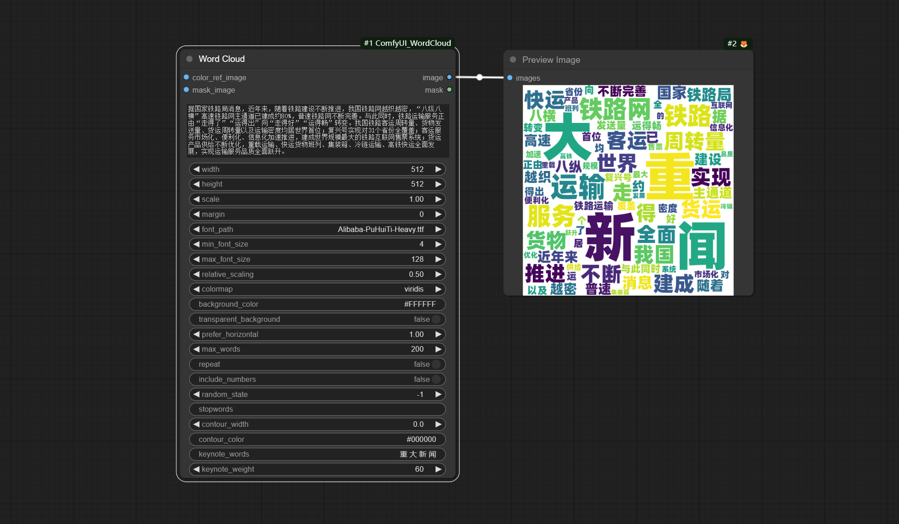

# Comfy WordCloud：
ComfyUI生成词云图像的插件。


### 更新：
通过编辑插件根目录下的font_dir.ini，用户可以自定义字体目录。每次启动comfyUI时，这个目录下*.ttf和*.otf文件将收集显示在插件font_path选择项中。

font_dir.ini默认是windows系统字体目录(C:\Windows\fonts)。

如果自定义的目录无效，将启用自带font目录，这个目录包含一个Alibaba-PuHuiTi-Heavy.ttf文件，版权归属阿里巴巴（中国）有限公司，允许任何个人和企业免费使用。

增加RGB Color Picker节点，选择颜色更加方便。

### 重要提醒：加载之前工作流保存的旧版节点，需要重新设置字体。
首先设置好font_dir.ini，启动comfyUI并加载工作流，在WordCloud节点的font_path选项栏中重新选择字体，即可避免报错。

* 本次更新基于[ZHO-ZHO-ZHO](https://github.com/ZHO-ZHO-ZHO/ComfyUI-Text_Image-Composite)的建议和帮助。


节点说明：

### Word Cloud:
根据文本内容生成词云图像，词的大小与词频相关，频率越高文字越大。可定义配色，设定重点词，设定排除词等。支持输入带alpha通道的图像生成具有轮廓形状的词云图像。

选项说明：   
* color_ref_image: 输入的图像作为文字颜色的参考。
* mask_image: 输入的图像作为文字形状的轮廓。如果带alpha通道，使用通道作为轮廓；不带通道的按颜色决定轮廓的形状，白色的部分将被排除。
* text: 此处的文本内容将分解为逐个单词，这些单词作为词云的元素。单词出现频率越高，在词云上描绘得越大。
* width: 生成图像的宽度。(如果有mask_image输入，则使用mask_image的尺寸，此设置数值被忽略)
* height: 生成图像的高度。(如果有mask_image输入，则使用mask_image的尺寸，此设置数值被忽略)
* scale: 放大系数，最终生成的图像大小将是width和height设定数值与此数相乘。
* margin: 空白边大小。
* font_path: 字体文件路径。建议使用ttf格式。
* min_font_size: 单词元素显示的最小值。
* max_font_size：单词元素显示的最大值。
* relative_scaling: 词云中单词元素的相对大小。值越大，离散度越高。
* colormap: 文字颜色。这里使用的是Matplotlib 提供的多种预定义colormap。(如果有color_ref_image输入，则此设置被忽略)
* background_color: 背景颜色，使用16进制RGB格式描述。(如果transparent_background设定为True，则此设置被忽略)
* transparent_background: 背景是否透明。此处设为True将输出带alpha通道的图像。
* prefer_horizontal: 单词水平出现率。最低0(全竖排)，最高1(全横排)。
* max_words: 单词最大数量。
* repeat: 当单词没有达到最大数量时是否允许重复。
* include_numbers: 单词元素是否包含数字。
* random_state：控制词云生成过程中随机数生成器的种子。设为-1为每次随机，其他值则每次固定。
* stopwords: 屏蔽词。设定在此处的单词不会在图中出现。每个词之间用逗号(中英文均可)或空格分开。
* contour_width: 轮廓宽度。有mask_image输入才有效。
* contour_color: 轮廓颜色。使用16进制RGB格式描述。有mask_image输入才有效。
* keynote_words: 重点词。这里设定的单词将额外放大，在stopwords中设定了同样单词的除外。每个词之间用逗号(中英文均可)或空格分开。
* keynote_weight: 重点词加权。数值越大，重点词相对越大。

输出：
image(支持alpha通道)

### RGB Color Picker
来自[mtb nodes](https://github.com/melMass/comfy_mtb)的Web Extensions，在色板上选取颜色，并输出RGB值。
选项说明：   
* mode： 输出格式，有十六进制(HEX)和十进制(DEC)可选择。  

输出： 
string字符串。

### Load Text File：
从指定路径加载文本文件，设定使用utf-8编码。

选项说明：   
* path： txt文件路径。   

输出： 
string字符串。

## 使用示例：


在workflow目录下有json格式的工作流示例文件。

## 安装方法：  

* git clone 安装，或者下载解压zip文件，将得到的文件夹复制到 ComfyUI\custom_nodes\
* 安装依赖包，在资源管理器ComfyUI\custom_nodes\ComfyUI_WordCloud 插件目录位置打开cmd窗口，输入以下命令：  
```..\..\..\python_embeded\python.exe -m pip install -r requirements.txt```
* 重新打开ComfyUI。
